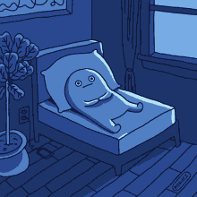

# Tic Tac Toe game with c
 

## Tic-Tac-Toe Game
### Compiling
Compile the file locally for your machine
```command line
$- gcc tictactoe.c -o tictactoegame
```
### Running
Run the file from the terminal
```commandline
$- ./tictactoegame
```
##### I can't stop



### Undocumented features

>- Sending a character input to the program results in an infinite loop
   (don't do it (or do))
   

### Libraries
- stdio.h
- stdlib.h

#### Built with
[@micoliser](https://github.com/micoliser)

#### License
>- [MIT License](./LICENSE)
