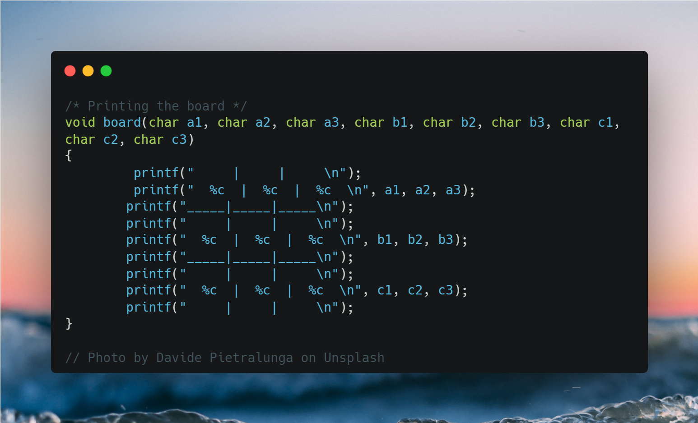

# Tic Tac Toe game with c
 

## Tic-Tac-Toe Game

### Compiling
Compile the file locally for your machine
```command line
$- gcc tictactoe.c -o tictactoegame
```
### Running
Run the file from the terminal
```commandline
$- ./tictactoegame
```
##### I can't stop


### Operation
>- Start the program by... running it

>- The first player is always o, will I change it, probably not 
 (you could play rock paper scissors here to find out who goes first)
>- Enter the coresponding cell to input your symbol at that location


>- The program will alert you if you try to overwrite an existing cell


#### Have fun for like 3mins


### Undocumented features
>- Sending a character input to the program results in an infinite loop
   (don't do it (or do))
   


#### Built with
[Micoliser](https://github.com/micoliser)

#### License
[MIT License](./LICENSE)
